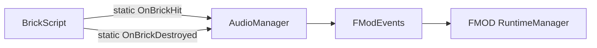

# Audio/ — FMOD Audio System

## Module Summary

Provides game-wide audio playback using **FMOD for Unity**. Plays randomized SFX on brick hit and brick destruction events.

## Scripts

| Script | Type | Purpose |
|---|---|---|
| `AudioManager` | `MonoBehaviour` | Central audio dispatcher. Subscribes to `BrickScript.OnBrickHit` / `OnBrickDestroyed` static events to play FMOD one-shots. Registered in `RootLifeTimeScope`. |
| `FModEvents` | `MonoBehaviour` | Inspector-serialized container of `EventReference[]` arrays mapping to FMOD Studio events. Singleton via static `Instance`. |

## Class Interactions

### Internal

- `AudioManager` reads `FModEvents.Instance.BrickHitSFX` and `BrickDestroyedSFX` arrays to randomly select an `EventReference`, then calls `RuntimeManager.PlayOneShot`.

### External

| Dependency | Relationship |
|---|---|
| `GamePlayScripts/BrickScript` | `AudioManager` subscribes to `BrickScript.OnBrickHit` and `OnBrickDestroyed` static events. |
| `FMODUnity` / `FMOD` | Low-level audio playback. |

## Design Patterns

- **Observer** — `AudioManager` reacts to static `EventHandler` events from `BrickScript`. This is a **tight coupling via static events**; no interface or DI boundary exists.

## Decoupling Notes

> **Heavy dependency**: `AudioManager` subscribes directly to `BrickScript`'s static events. If `BrickScript` changes its event signature, `AudioManager` breaks. Consider routing through a dedicated audio event bus or `System.Action` delegate on `BrickManager`.

> Both `AudioManager` and `FModEvents` use **legacy `static Instance`** singletons alongside VContainer. `AudioManager` is registered in `RootLifeTimeScope` but `FModEvents` is not — potential inconsistency.

## Mermaid Diagram

