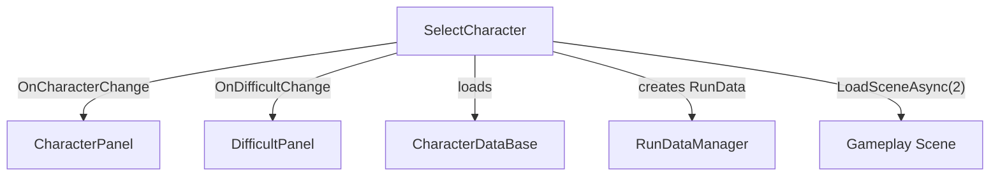

# Character/ — Character Selection Scene

## Module Summary

Handles the **character and difficulty selection screen** (Scene 1). Players pick a character with pre-configured upgrades and choose a difficulty level before starting a gameplay run.

## Scripts

| Script | Type | VContainer Registration | Purpose |
|---|---|---|---|
| `CharacterLifetimeScope` | `LifetimeScope` | — (self) | Scene-scoped DI container. Registers the three components below. |
| `SelectCharacter` | `MonoBehaviour` | `RegisterComponentInHierarchy` | Core controller: manages character/difficulty index cycling, creates `RunData`, triggers scene load to gameplay. |
| `CharacterPanel` | `MonoBehaviour` | `RegisterComponentInHierarchy` | UI panel displaying the currently selected character's icon, name, and description. |
| `DifficultPanel` | `MonoBehaviour` | `RegisterComponentInHierarchy` | UI panel displaying the current difficulty label. |
| `CharacterEntry` | Plain class | — | Lightweight DTO for character list entries. |
| `SelectState` | Plain class | — | Enum-like state tracking for the selection flow. |

## Class Interactions

### Internal

- `SelectCharacter` fires `OnCharacterChange` and `OnDifficultChange` events.
- `CharacterPanel` subscribes to `OnCharacterChange` to update the UI.
- `DifficultPanel` subscribes to `OnDifficultChange` to update the difficulty label.
- On "Play" click, `SelectCharacter` creates a new `RunData` via `RunDataManager` and loads Scene 2.

### External

| Dependency | Relationship |
|---|---|
| `Singleton/RunDataManager` | `SelectCharacter` calls `CreateNewRun()` and `Save()`. |
| `Singleton/CharacterDataBase` | `SelectCharacter` loads `CharacterSO` list via `GetCharacters()`. |
| `Singleton/PlayerDataManager` | Referenced for difficulty unlock checks (planned). |
| `SOScripts/CharacterSO` | Data source for character display. |

## Dependency Injection (VContainer)

- `CharacterLifetimeScope` is a **child** of `RootLifeTimeScope`.
- Injects `RunDataManager`, `CharacterDataBase`, `PlayerDataManager` from the parent scope.

## Design Patterns

- **Observer** — `SelectCharacter` exposes `Action<int>` events consumed by `CharacterPanel` and `DifficultPanel`.

## Mermaid Diagram

