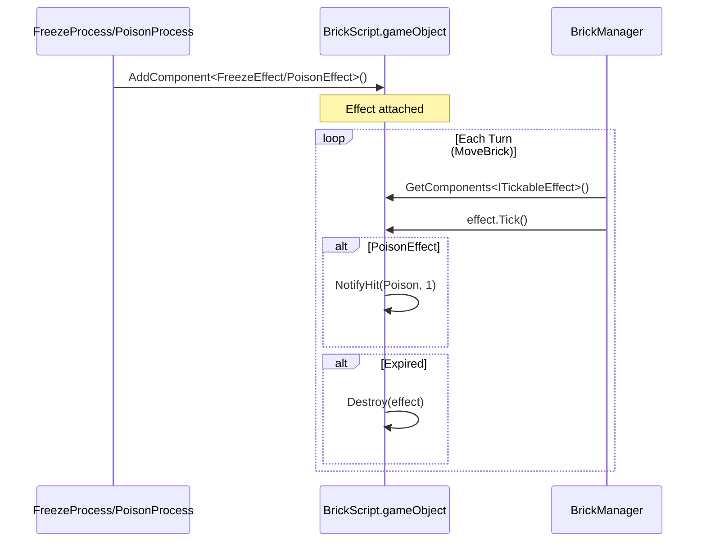

# GamePlayScripts/BrickVariant/BrickEffect/ — Turn-Based Brick Effects

## Module Summary

**Duration-based effects** that are dynamically added to brick GameObjects by `Process` classes and ticked each turn by `BrickManager`.

## Scripts

| Script | Type | Purpose |
|---|---|---|
| `ITickableEffect` | Interface | Contract for turn-ticked effects: `Tick()` (called each turn) and `IsActive()`. |
| `FreezeEffect` | `MonoBehaviour`, `ITickableEffect` | Prevents brick movement for `remainingTurns`. `BrickManager.MoveBrick()` skips bricks with this component. Self-destroys when expired. |
| `PoisonEffect` | `MonoBehaviour`, `ITickableEffect` | Deals 1 damage per turn via `BrickScript.NotifyHit(DamageSource.Poison)`. Self-destroys when expired or brick dies. |

## Class Interactions

### Internal

- Both effects implement `ITickableEffect` and self-destruct via `Destroy(this)` when their `remainingTurns` reaches zero.
- `PoisonEffect` holds a `BrickScript` reference from `GetComponent()` on init.

### External

| Dependency | Relationship |
|---|---|
| `Manager/BrickManager` | Calls `GetComponents<ITickableEffect>()` on each brick during `MoveBrick()` and invokes `Tick()`. Special-cases `FreezeEffect` to skip movement. |
| `SOScripts/Process/FreezeProcess` | Creates `FreezeEffect` via `AddComponent`. |
| `SOScripts/Process/PoisonProcess` | Creates `PoisonEffect` via `AddComponent`. |

## Design Patterns

- **Component Pattern** — Effects are runtime-added MonoBehaviour components, enabling stacking and independent lifecycle.

## Mermaid Diagram

