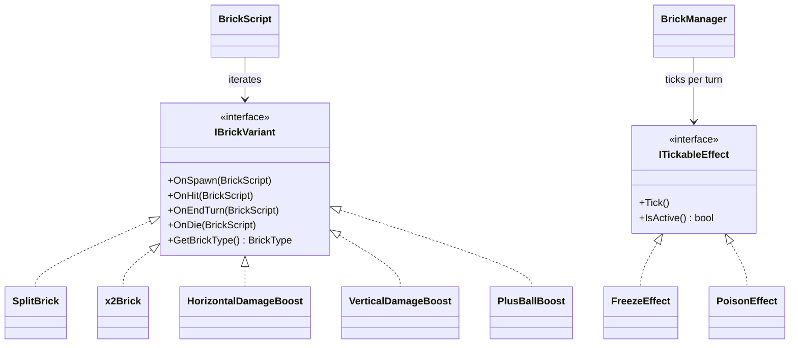

# GamePlayScripts/BrickVariant/ — Brick Specialization System

## Module Summary

Implements **brick variant behaviors** via the Strategy pattern. Each brick GameObject can have multiple `IBrickVariant` components that define special on-spawn, on-hit, and on-die reactions. Also contains **turn-based brick effects** (Poison, Freeze) applied by processes.

## Sub-Folder Index

| Folder | Purpose |
|---|---|
| `Brick/` | Concrete `IBrickVariant` implementations for special brick types. |
| `BrickEffect/` | `ITickableEffect` components for duration-based effects (Poison, Freeze). |
| `MiniBoss/` | Boss and mini-boss brick variants for scheduled enemy pressure spikes. |

## Scripts (Root)

| Script | Type | Purpose |
|---|---|---|
| `IBrickVariant` | Interface | Strategy contract: `OnSpawn`, `OnHit`, `OnEndTurn`, `OnDie`, `GetBrickType`. |

## Class Interactions

### Internal

- `BrickScript.Init()` collects all `IBrickVariant` components via `GetComponents<IBrickVariant>()`.
- On damage, `BrickScript.OnDamage()` / `OnDeath()` iterates variants and calls the lifecycle hooks.
- `ITickableEffect` components are ticked by `BrickManager.TickBrickEffects()` during `MoveBrick()`.

### External

| Dependency | Relationship |
|---|---|
| `GamePlayScripts/BrickScript` | Variants are attached as sibling components on the same GameObject. |
| `Manager/BrickManager` | Ticks `ITickableEffect` components. Checks `FreezeEffect` to skip frozen brick movement. |
| `SOScripts/Process/FreezeProcess` | Adds `FreezeEffect` components dynamically. |
| `SOScripts/Process/PoisonProcess` | Adds `PoisonEffect` components dynamically. |

## Design Patterns

- **Strategy** — `IBrickVariant` lets each brick prefab compose different behaviors (split, x2 health, beam damage, etc.) without modifying `BrickScript`.
- **Component Pattern** — Effects are added/removed as MonoBehaviour components at runtime (`AddComponent<FreezeEffect>()`).

## Mermaid Diagram

