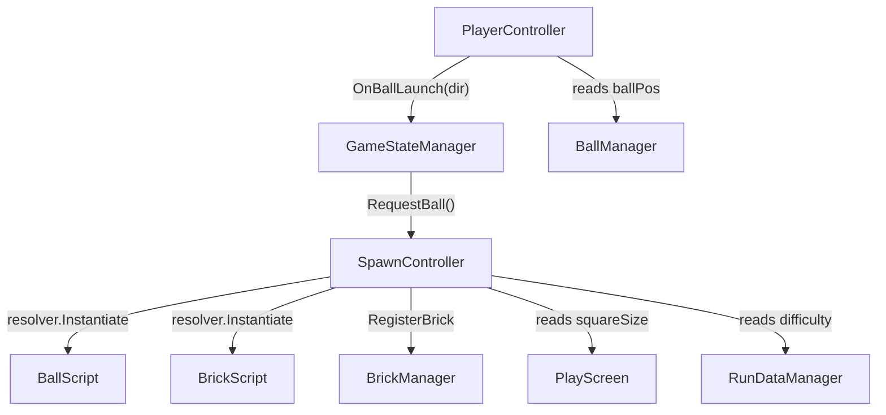

# GamePlayScripts/Controller/ — Input & Spawning

## Module Summary

Handles **player input** (aiming/launching balls) and **entity spawning** (bricks and balls onto the game grid).

## Scripts

| Script | Type | VContainer | Purpose |
|---|---|---|---|
| `PlayerController` | `MonoBehaviour` | Hierarchy | Processes mouse/touch input for aiming. Draws a `LineRenderer` trajectory and fires `OnBallLaunch` event on mouse-up. Guards against UI overlay clicks. |
| `SpawnController` | `MonoBehaviour` | Hierarchy | Creates and scales bricks/balls on the game grid. Handles screen setup (walls, background), initial brick placement, per-wave brick spawning, mini-boss spawning, and brick state restoration from save data. |

## Class Interactions

### Internal

- `PlayerController` reads `BallManager.ballPos` for trajectory origin and fires `OnBallLaunch` event.
- `SpawnController` calls `BrickManager.RegisterBrick()` after instantiation and `BallManager.GetBallPos()` for ball spawn position.

### External

| Dependency | Relationship |
|---|---|
| `Manager/BallManager` | `PlayerController` reads ball position. `SpawnController` spawns balls. |
| `Manager/BrickManager` | `SpawnController` registers bricks into the grid array. |
| `PlayScreen` | Both controllers use `squareSize` for grid-to-world coordinate math. |
| `Singleton/RunDataManager` | `SpawnController` reads `runData` for difficulty and brick restoration. |
| `WaveScript` | `SpawnController` uses wave index for brick health curve and eligible brick types. |
| `VContainer/IObjectResolver` | `SpawnController` uses `resolver.Instantiate()` for DI-aware spawning. |

## Design Patterns

- **Observer** — `PlayerController.OnBallLaunch` is consumed by `GameStateManager`.
- **Factory** — `SpawnController` acts as a factory for `BallScript` and `BrickScript` entities, using weighted random selection for brick types.

## Decoupling Notes

> **Heavy**: `SpawnController.SpawnBall()` accepts `BallManager`, `StatManager`, `UpgradeManager`, and `squareSize` as parameters — this method signature is bloated. Consider passing a single context/config struct.

> Brick prefabs are configured via a serialized `Brick[]` array on `SpawnController` with spawn chances and wave thresholds. This is effective data-driven design.

## Mermaid Diagram

