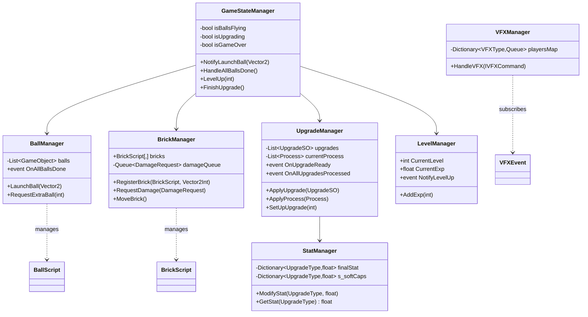

# GamePlayScripts/Manager/ — Core Game Managers

## Module Summary

Scene-wide manager classes that own the **game state, brick grid, ball lifecycle, upgrade pipeline, stat calculations, level/exp progression, and VFX pooling**.

## Scripts

| Script | Type | VContainer | Purpose |
|---|---|---|---|
| `GameStateManager` | `MonoBehaviour` | Hierarchy | **Central orchestrator**. Coordinates turn flow via event subscriptions. Manages `isBallsFlying`, `isUpgrading`, `isGameOver` state flags. |
| `BrickManager` | `MonoBehaviour` | Hierarchy | Owns the `BrickScript[8,10]` grid array. Processes a damage queue each `Update()`. Handles brick movement, tick effects, and game-over detection. |
| `BallManager` | `MonoBehaviour` | Hierarchy | Manages ball list, launch sequencing (staggered coroutine), ball-finish tracking, timeout speed-up, and ball position state. |
| `UpgradeManager` | POCO | Singleton | Manages upgrade inventory, pending upgrade queue, random selection, process application, and magnet toggle. |
| `StatManager` | POCO | Singleton | Dictionary-based stat container with `baseStat`, `finalStat`, and `s_softCaps`. Provides `ModifyStat()` with soft-cap clamping. |
| `LevelManager` | `MonoBehaviour` | Hierarchy | Exp accumulation and recursive level-up logic. Fires `NotifyLevelUp`, `NotifyExpChanged` events. |
| `VFXManager` | `MonoBehaviour` | Hierarchy | VFX object pool manager. Subscribes to `VFXEvent.OnVFXCommand`. Pre-warms pools per `VFXType` from serialized prefab config. |

## Class Interactions

### Internal

- `GameStateManager` depends on **all other managers** via `[Inject]`.
- `BrickManager` calls `ShockwaveProcess.TryShockwave()` directly when a brick dies (tight coupling to a specific process).
- `BallManager` delegates ball creation to `GameStateManager.RequestBall()` → `SpawnController.SpawnBall()`.
- `UpgradeManager` routes stat changes to `StatManager` and process creation to `ProcessFactory`.

### External

| Dependency | Relationship |
|---|---|
| `Singleton/RunDataManager` | `GameStateManager`, `BrickManager`, `BallManager` for save/restore. |
| `SOScripts/UpgradeSO` | `UpgradeManager` applies upgrade logic. |
| `Utils/ProcessFactory` | `UpgradeManager` creates processes. |
| `VFX/VFXEvent` | `VFXManager` subscribes to the static event bus. |

## Dependency Injection (VContainer)

- `StatManager` and `UpgradeManager` are **pure C# classes** registered as `Singleton` — no MonoBehaviour overhead.
- `VFXManager` uses `[Inject] IObjectResolver` to inject dependencies into pooled VFX player instances.
- `GameStateManager` has the **largest injection footprint** (11 constructor parameters).

## Design Patterns

| Pattern | Instance |
|---|---|
| **Observer** | All managers expose `System.Action` events. `GameStateManager` subscribes. |
| **Damage Queue** | `BrickManager` uses a `Queue<DamageRequest>` to batch and deduplicate damage within a frame. |
| **Soft-Cap Strategy** | `StatManager.s_softCaps` dictionary clamps stats after modification. |
| **Object Pool** | `VFXManager` pre-warms and recycles `VFXPlayerBase` instances. |

## Decoupling Notes

> **Heavy**: `GameStateManager` directly references 11 injected services. Consider a mediator or event aggregator to reduce constructor bloat.

> **Heavy**: `BrickManager.Update()` calls `ShockwaveProcess.TryShockwave()` with a **static method** — bypasses the normal process pipeline. The shockwave is the only process that operates on brick death rather than ball hit, so it's handled outside the standard `Process.OnHit()` flow.

> `DamageRequest` is a well-designed **readonly struct** declared alongside `BrickManager` — consider extracting to a shared location if other systems need it.

## Mermaid Diagram

