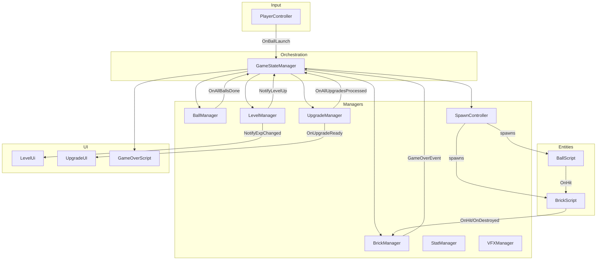

    # GamePlayScripts/ — Core Gameplay Systems

## Module Summary

The **heart of the Break Brick runtime**. Contains all gameplay-scene systems: the turn-loop state machine, brick/ball physics, player input, spawning, upgrade processing, level progression, game-over flow, shop, and in-game UI.

All classes here are registered in `GameLifetimeScope` and receive cross-scene services from `RootLifeTimeScope`.

## Sub-Folder Index

| Folder | Purpose |
|---|---|
| `Manager/` | Scene-wide manager classes (state, bricks, balls, upgrades, stats, level, VFX). |
| `Controller/` | Player input (`PlayerController`) and entity spawning (`SpawnController`). |
| `BrickVariant/` | Brick specialization via the Strategy pattern (`IBrickVariant` + effects). |
| `Ui/` | In-game HUD: level/exp bar, upgrade selection panel. |
| `Shop/` | In-game shop for consumable items. |

## Root-Level Scripts

| Script | Type | VContainer Registration | Purpose |
|---|---|---|---|
| `GameLifetimeScope` | `LifetimeScope` | — (self) | Scene-scoped DI container for gameplay. |
| `BallScript` | `MonoBehaviour` | `Transient` | Per-ball entity. Handles physics, collisions, and process execution on hit. |
| `BrickScript` | `MonoBehaviour` | `Transient` | Per-brick entity. Manages health, variants, damage intake, and destroy lifecycle. |
| `PlayScreen` | POCO | `Singleton` | Calculates `squareSize` from camera orthographic bounds for grid scaling. |
| `WaveScript` | `MonoBehaviour` | `RegisterComponentInHierarchy` | Tracks and displays the current wave index. |
| `GameOverScript` | `MonoBehaviour` | `RegisterComponentInHierarchy` | Async game-over panel with `TaskCompletionSource`. |

## Turn-Loop Flow (GameStateManager Orchestration)

```
StartGame / ContinueGame
       │
       ▼
  PlayerCanShoot ─── PlayerController.OnBallLaunch ───► BallManager.LaunchBall()
       │                                                     │
       │                                                     ▼
       │                                              Balls fly & hit bricks
       │                                              BallScript.ApplyProcess()
       │                                                     │
       │                                                     ▼
       │                                         BallManager.OnAllBallsDone
       │                                                     │
       ▼                                                     ▼
  GameStateManager.HandleAllBallsDone()                BrickManager.MoveBrick()
       │       │                                       TickBrickEffects()
       │       ├── SpawnController.SpawnBrick()         (Poison/Freeze)
       │       ├── WaveScript.IncreaseWave()
       │       └── CheckTurnState()
       │              │
       │              ▼
       │     LevelManager.NotifyLevelUp?
       │              │ yes
       │              ▼
       │     UpgradeManager.SetUpUpgrade()
       │     UpgradeUI.ShowUpgradeOptions()
       │              │ player picks
       │              ▼
       │     UpgradeManager.ApplyUpgrade()
       │     OnAllUpgradesProcessed → FinishUpgrade()
       │              │
       └──────────────┘ → SetPlayerCanShoot(true)
```

## Class Interactions

### Internal (Cross-Folder)

- `GameStateManager` is the **central orchestrator** — it subscribes to events from `BallManager`, `PlayerController`, `LevelManager`, `UpgradeManager`, and `BrickManager`.
- `SpawnController` creates `BallScript` / `BrickScript` instances via `IObjectResolver.Instantiate`.
- `BallScript` triggers `Process.OnHit()` for each process in its list on brick collision.
- `BrickScript` fires `OnHit` / `OnDestroyed` events consumed by `BrickManager`.

### External

| Dependency | Relationship |
|---|---|
| `Singleton/RunDataManager` | Save/restore game state. |
| `SOScripts/PowerUp/*` | `UpgradeSO`, `Process`, `IBehavior` — data-driven upgrade application. |
| `Utils/ProcessFactory` | Creates `Process` instances during upgrade application. |
| `VFX/VFXEvent` | Processes raise VFX commands. |

## Dependency Injection (VContainer)

All registrations in `GameLifetimeScope.Configure()`:

| Registration | Lifetime | Type |
|---|---|---|
| `PlayScreen` | `Singleton` | POCO (with constructor params) |
| `StatManager` | `Singleton` | POCO |
| `UpgradeManager` | `Singleton` | POCO |
| `ProcessFactory` | `Singleton` | POCO |
| `BallScript` | `Transient` | MonoBehaviour |
| `BrickScript` | `Transient` | MonoBehaviour |
| `GameStateManager` | Hierarchy | MonoBehaviour |
| `SpawnController` | Hierarchy | MonoBehaviour |
| `PlayerController` | Hierarchy | MonoBehaviour |
| `BrickManager` | Hierarchy | MonoBehaviour |
| `BallManager` | Hierarchy | MonoBehaviour |
| `LevelManager` | Hierarchy | MonoBehaviour |
| `VFXManager` | Hierarchy | MonoBehaviour |
| `LevelUi` | Hierarchy | MonoBehaviour |
| `UpgradeUI` | Hierarchy | MonoBehaviour |
| `QuitScript` | Hierarchy | MonoBehaviour |
| `WaveScript` | Hierarchy | MonoBehaviour |
| `GameOverScript` | Hierarchy | MonoBehaviour |

## Design Patterns

| Pattern | Usage |
|---|---|
| **Observer** | `System.Action` delegates across all managers. GameStateManager subscribes/coordinates. |
| **Strategy** | `IBrickVariant` on bricks, `Process` subclasses for on-hit effects. |
| **Command** | `IVFXCommand` raised from processes. |
| **Factory** | `SpawnController` spawns entities via `IObjectResolver`. `ProcessFactory` creates processes. |
| **State Machine** (implicit) | `GameStateManager` tracks `isBallsFlying`, `isUpgrading`, `isGameOver` flags. |

## Mermaid Diagram


