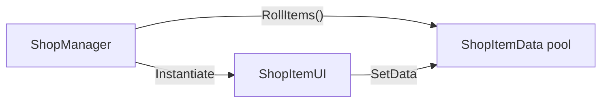

# GamePlayScripts/Shop/ — In-Game Item Shop

## Module Summary

An in-game shop that presents randomized consumable items to the player between waves.

## Scripts

| Script | Type | Purpose |
|---|---|---|
| `ShopManager` | `MonoBehaviour` | Controls shop open/close lifecycle and item rolling. Randomly selects 6 items from a serialized `List<ShopItemData>` using `ListExtension.GetRandomElements()`. |
| `ShopItemUI` | `MonoBehaviour` | Per-item UI card. Receives `ShopItemData` and populates icon, name, and price. |
| `ShopItemData` | `ScriptableObject` | Data container for shop items (icon, name, price, effect). |

## Class Interactions

### Internal

- `ShopManager.RollItems()` clears the grid, randomly selects items from the available pool, instantiates `ShopItemUI` prefabs, and calls `SetData()`.

### External

| Dependency | Relationship |
|---|---|
| `Utils/ListExtension` | `GetRandomElements(6)` extension method for random subset. |

## Design Patterns

- **Data-Driven UI** — `ShopItemData` ScriptableObjects define the item pool. `ShopManager` is purely a presenter.

## Decoupling Notes

> **Bug**: `CloseShop()` calls `SetActive(true)` instead of `false` — this is likely a copy-paste error.

> The shop is **not yet integrated** into the turn loop via `GameStateManager`. It has no VContainer registration and no connection to `UpgradeManager` or `StatManager`.

## Mermaid Diagram

