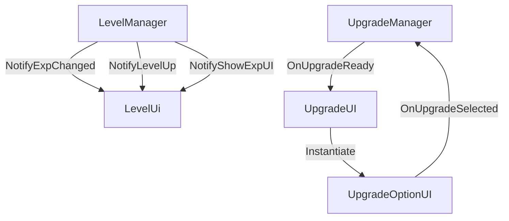

# GamePlayScripts/Ui/ — In-Game HUD

## Module Summary

In-game heads-up display components for **level/exp progression** and **upgrade selection** panels.

## Scripts

| Script | Type | VContainer | Purpose |
|---|---|---|---|
| `LevelUi` | `MonoBehaviour` | Hierarchy | Displays level numbers and an exp slider bar. Subscribes to `LevelManager` events for reactive updates. Uses **DOTween** for fade-in/out animations. |
| `UpgradeUI` | `MonoBehaviour` | Hierarchy | Manages the upgrade selection overlay. Subscribes to `UpgradeManager.OnUpgradeReady` and dynamically instantiates `UpgradeOptionUI` buttons. Uses a coroutine queue to avoid overlapping upgrade panels. |
| `UpgradeOptionUI` | `MonoBehaviour` | — (Prefab) | Individual upgrade button. Displays upgrade icon, name, description, and triggers selection callback. |

## Class Interactions

### Internal

- `UpgradeUI` instantiates `UpgradeOptionUI` prefabs dynamically. On selection, calls `OnUpgradeSelected` → `UpgradeManager.ApplyUpgrade()`.

### External

| Dependency | Relationship |
|---|---|
| `Manager/LevelManager` | `LevelUi` subscribes to `NotifyExpChanged`, `NotifyLevelUp`, `NotifyShowExpUI`. |
| `Manager/UpgradeManager` | `UpgradeUI` subscribes to `OnUpgradeReady`, calls `ApplyUpgrade()`. |
| `SOScripts/UpgradeSO` | `UpgradeOptionUI` reads upgrade display data (name, description, icon). |
| `DG.Tweening` (DOTween) | `LevelUi` uses `DOFade` and `Sequence` for panel animations. |

## Design Patterns

- **Observer** — Both UI components react to manager events rather than polling.
- **Queued Display** — `UpgradeUI` uses `WaitWhile(() => isShowingOptions)` to serialize multiple upgrade offerings.

## Mermaid Diagram

