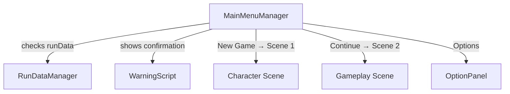

# MainMenuScripts/ — Main Menu Scene

## Module Summary

Controls the **main menu** (Scene 0): new game, continue, and options panel navigation.

## Scripts

| Script | Type | VContainer Registration | Purpose |
|---|---|---|---|
| `MainMenuLifeTimeScope` | `LifetimeScope` | — (self) | Scene-scoped DI container. Registers `MainMenuManager`. |
| `MainMenuManager` | `MonoBehaviour` | `RegisterComponentInHierarchy` | Central UI controller: handles New Game (with overwrite warning), Continue, and Options buttons. |
| `OptionPanel` | `MonoBehaviour` | — (UI-only) | Simple close-panel behavior for the options overlay. |
| `WarningScript` | `MonoBehaviour` | — (UI-only) | Async confirmation dialog when the player starts a new game with an existing run. Returns `Task<bool>`. |

## Class Interactions

### Internal

- `MainMenuManager` references `WarningScript` (fetched via `GetComponent`) and toggles the warning panel on new-game when existing `RunData` exists.
- `OptionPanel` is self-contained.

### External

| Dependency | Relationship |
|---|---|
| `Singleton/RunDataManager` | `MainMenuManager` checks `runData != null` for the Continue button, calls `DeleteRun()` on confirmed overwrite. |
| `UnityEngine.SceneManagement` | `LoadSceneAsync(1)` → Character Scene, `LoadSceneAsync(2)` → Gameplay Scene. |

## Dependency Injection (VContainer)

- `MainMenuLifeTimeScope` is a **child** of `RootLifeTimeScope`.
- Injects `RunDataManager` from the parent scope.

## Design Patterns

- **Async Confirmation** — `WarningScript.WaitForUser()` returns `Task<bool>`, enabling `await`-based UI flow without coroutine nesting.

## Mermaid Diagram

