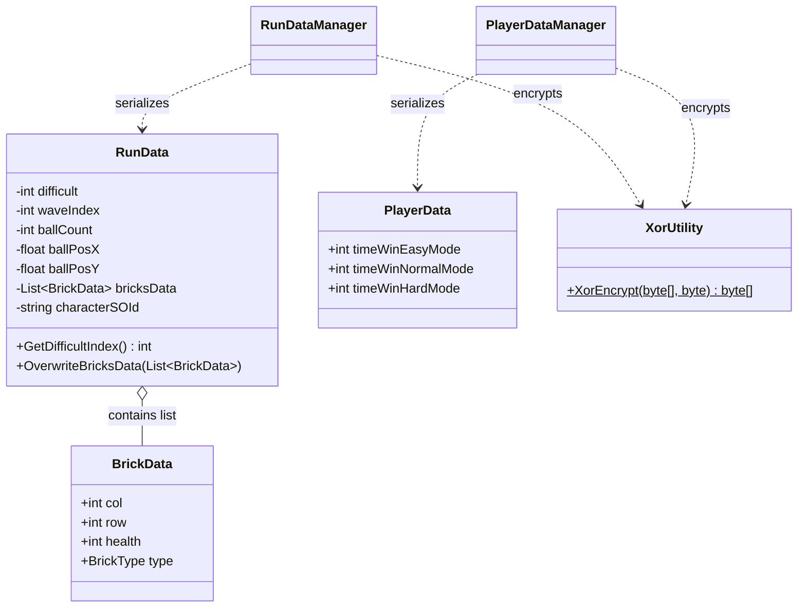

# PlayerData/ — Serializable Data Models

## Module Summary

Plain C# data classes (POCOs/structs) that represent the **serialization schema** for player progress and run state. These are the "wire format" consumed by `Singleton/RunDataManager` and `Singleton/PlayerDataManager`.

## Scripts

| Script | Purpose |
|---|---|
| `RunData` | Per-run save state: difficulty, wave index, ball count/position, brick grid snapshot, selected character ID. Serialized via `System.Text.Json`. |
| `PlayerData` | Long-lived player progress: difficulty unlock counters (`timeWinEasyMode`, etc.). |
| `BrickData` | Grid-cell snapshot of a single brick: column, row, health, `BrickType`. Used inside `RunData.bricksData`. |
| `UpgradeData` | **Stub** — mostly commented out. Planned to serialize per-upgrade state for save/restore. |
| `XorUtility` | Simple XOR encryption helper for obfuscating save files at rest. |

## Class Interactions

### Internal

- `RunData` holds a `List<BrickData>` for brick grid persistence.
- `XorUtility` is used by both `RunDataManager` and `PlayerDataManager` for encrypt/decrypt.

### External

| Dependency | Relationship |
|---|---|
| `Singleton/RunDataManager` | Serializes/deserializes `RunData`. |
| `Singleton/PlayerDataManager` | Serializes/deserializes `PlayerData`. |
| `Enum/BrickType` | `BrickData.type` field. |
| `System.Text.Json` | JSON serialization with `[JsonInclude]` attributes. |

## Decoupling Notes

- **ScriptableObjects as data bridge**: `RunData` stores a `characterSOId` string reference to the `CharacterSO` asset rather than embedding a full copy. This keeps save files lightweight and Addressable-friendly.
- `XorUtility` inherits `MonoBehaviour` unnecessarily — it only uses a `static` method. **Refactoring candidate** to a plain `static class`.

## Mermaid Diagram

