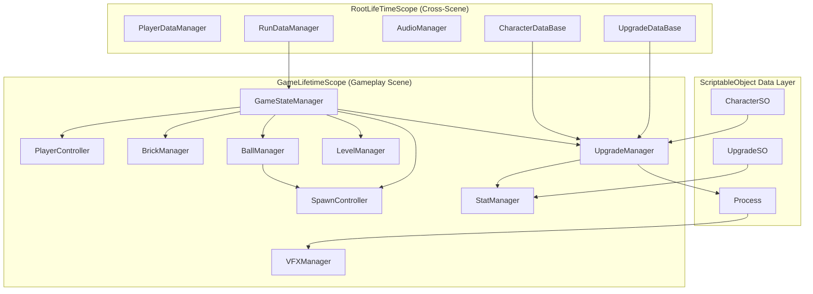

# Assets/Scripts — Project Root

## Module Summary

Top-level orchestration layer for the **Break Brick** roguelike brick-breaker game.  
The Scripts folder is partitioned by **scene-layer responsibility**: global singletons that survive scene loads, per-scene gameplay logic, data models, ScriptableObject definitions, visual effects, and shared utilities.

## Folder Index

| Folder | Purpose |
|---|---|
| `Singleton/` | Root-scoped services (data persistence, asset databases). Registered in `RootLifeTimeScope`. |
| `GamePlayScripts/` | All in-game systems: managers, controllers, brick logic, UI, and shop. Registered in `GameLifetimeScope`. |
| `SOScripts/` | ScriptableObject definitions for the upgrade/powerup system and character configuration. |
| `PlayerData/` | Plain C# data models (POCOs/structs) for serialization: `RunData`, `PlayerData`, `BrickData`. |
| `Enum/` | Shared enum types used across all modules. |
| `Audio/` | FMOD-based audio management. |
| `Character/` | Character selection scene UI and its `CharacterLifetimeScope`. |
| `MainMenuScripts/` | Main menu scene UI and `MainMenuLifeTimeScope`. |
| `VFX/` | Command-pattern VFX pipeline (commands, players, event bus). |
| `Utils/` | Shared utility classes, factories, and UI helpers. |
| `Testing/` | Experimental/prototype scripts. Not part of the production pipeline. |

## VContainer Lifetime Scope Hierarchy

```
RootLifeTimeScope (DontDestroyOnLoad)
├── PlayerDataManager      (Singleton, MonoBehaviour)
├── RunDataManager          (Singleton, MonoBehaviour)
├── AudioManager            (Singleton, MonoBehaviour)
├── UpgradeDataBase         (Singleton, MonoBehaviour)
└── CharacterDataBase       (Singleton, MonoBehaviour)
    │
    ├── MainMenuLifeTimeScope (Scene 0)
    │   └── MainMenuManager
    │
    ├── CharacterLifetimeScope (Scene 1)
    │   ├── SelectCharacter
    │   ├── CharacterPanel
    │   └── DifficultPanel
    │
    └── GameLifetimeScope (Scene 2)
        ├── PlayScreen          (Singleton, POCO)
        ├── StatManager         (Singleton, POCO)
        ├── UpgradeManager      (Singleton, POCO)
        ├── ProcessFactory      (Singleton, POCO)
        ├── GameStateManager    (MonoBehaviour)
        ├── SpawnController     (MonoBehaviour)
        ├── PlayerController    (MonoBehaviour)
        ├── BrickManager        (MonoBehaviour)
        ├── BallManager         (MonoBehaviour)
        ├── LevelManager        (MonoBehaviour)
        ├── VFXManager          (MonoBehaviour)
        ├── LevelUi             (MonoBehaviour)
        ├── UpgradeUI           (MonoBehaviour)
        ├── QuitScript          (MonoBehaviour)
        ├── WaveScript          (MonoBehaviour)
        ├── GameOverScript      (MonoBehaviour)
        ├── BallScript          (Transient)
        └── BrickScript         (Transient)
```

## High-Level Architecture Diagram



## Design Patterns in Use

| Pattern | Location | Description |
|---|---|---|
| **Observer / Event Bus** | `GameStateManager`, `BallManager`, `LevelManager`, `VFXEvent` | `System.Action` delegates decouple managers. `VFXEvent` is a global static event bus. |
| **Command** | `VFX/` module | `IVFXCommand` implementations encapsulate VFX execution data. |
| **Strategy** | `SOScripts/PowerUp/Process/` | `Process` subclasses provide interchangeable on-hit behaviors. |
| **Factory** | `Utils/ProcessFactory` | Creates `Process` instances from `UpgradeType` keys. |
| **Dependency Injection** | VContainer `LifetimeScope` classes | Constructor injection (`[Inject]`) across all managers. |
| **ScriptableObject as Data Bridge** | `UpgradeSO`, `CharacterSO` | Decouples authoring-time data from runtime logic. |

## Communication

- **Cross-scene data** flows through `RootLifeTimeScope`-registered singletons (`RunDataManager`, `PlayerDataManager`).
- **Intra-scene orchestration** is handled by `GameStateManager`, which subscribes to events from other managers and coordinates the turn loop.
- **VFX** is fully decoupled via `VFXEvent` static event bus — processes raise commands, `VFXManager` listens.
