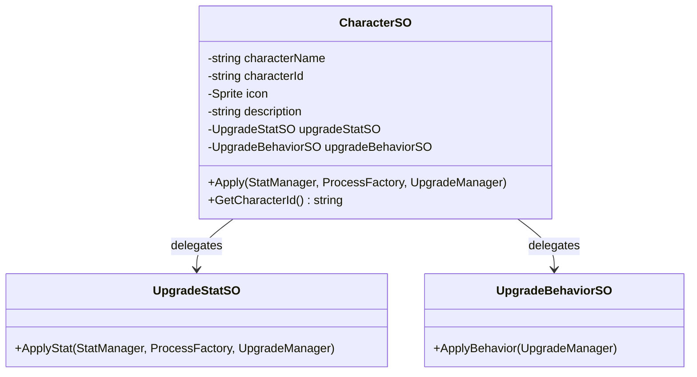

# SOScripts/CharacterPowerUp/ — Character Definitions

## Module Summary

**Character data containers** that bundle initial stat and behavior upgrades together. Each `CharacterSO` represents a playable character with a pre-configured loadout applied at game start.

## Scripts

| Script | Type | Purpose |
|---|---|---|
| `CharacterSO` | `ScriptableObject` | Character definition: name, ID (auto-generated GUID), icon, description, and references to `UpgradeStatSO` + `UpgradeBehaviorSO`. |

## Class Interactions

### Internal

No internal dependencies.

### External

| Dependency | Relationship |
|---|---|
| `SOScripts/PowerUp/UpgradeStatSO` | `CharacterSO.Apply()` delegates to `UpgradeStatSO.ApplyStat()`. |
| `SOScripts/PowerUp/UpgradeBehaviorSO` | Delegates to `UpgradeBehaviorSO.ApplyBehavior()`. |
| `Manager/StatManager` | Passed through to `UpgradeStatSO.ApplyStat()`. |
| `Manager/UpgradeManager` | Passed through to both stat and behavior SO. |
| `Utils/ProcessFactory` | Passed through to `UpgradeStatSO.ApplyStat()`. |
| `Singleton/CharacterDataBase` | `CharacterSO` assets are loaded via Addressables and cached. |

## Design Patterns

- **Composite / Façade** — `CharacterSO.Apply()` is a single-call façade that applies both stat and behavior upgrades, hiding the split SO structure from the caller.

## Decoupling Notes

> `CharacterSO.Apply()` takes three parameters (`StatManager`, `ProcessFactory`, `UpgradeManager`) — this is a **pass-through coupling**. Consider a single context object.

> The `OnValidate()` auto-ID generation uses `#if UNITY_EDITOR` correctly.

## Mermaid Diagram

