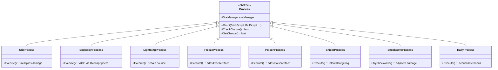

# SOScripts/PowerUp/Process/ — On-Hit Process Strategies

## Module Summary

Concrete `Process` subclass implementations — each represents a **proc-on-hit effect** that triggers probabilistically when a ball collides with a brick.

## Scripts

| Script | Type | Purpose |
|---|---|---|
| `CritProcess` | `Process` | Multiplies damage by the `CritMultiplier` stat. No VFX. |
| `ExplosionProcess` | `Process` | AOE damage via `Physics.OverlapSphere`. Radius from `ExplosionRadius` stat. Raises `ExplosionVFXCommand`. |
| `LightningProcess` | `Process` | Chain lightning to nearest bricks. Bounce count from `LightningBounces` stat. Raises `LightningVFXCommand`. |
| `FreezeProcess` | `Process` | Adds `FreezeEffect` component to the brick. Duration from `FreezeDuration` stat. Raises `FreezeVFXCommand`. |
| `PoisonProcess` | `Process` | Adds `PoisonEffect` component to the brick. Duration from `PoisonDuration` stat. Raises `PoisonVFXCommand`. |
| `SniperProcess` | `Process` | Targets a specific brick at intervals (every N hits). Uses `SniperInterval` stat. |
| `ShockwaveProcess` | `Process` | Triggered on brick death (not ball hit). Damages adjacent bricks. Called directly by `BrickManager` via `TryShockwave()` — static access pattern. |
| `RallyProcess` | `Process` | Accumulates `RallyBonus` across consecutive hits within a turn. |
| `FireProcess` | `Process` | Sets bricks on fire (damage over time). |

## Class Interactions

### Internal

- All processes read stats from `StatManager` via the `statManager` field set during construction.
- Each process calls `VFXEvent.RaiseVFXCommand()` with the appropriate command type.

### External

| Dependency | Relationship |
|---|---|
| `Manager/StatManager` | Read proc chance and effect values. |
| `Manager/BrickManager` | `ExplosionProcess` and `LightningProcess` request damage on other bricks. `ShockwaveProcess` is called by `BrickManager`. |
| `BrickVariant/BrickEffect/FreezeEffect` | `FreezeProcess` adds/refreshes this component. |
| `BrickVariant/BrickEffect/PoisonEffect` | `PoisonProcess` adds/refreshes this component. |
| `VFX/VFXEvent` | All processes raise VFX commands. |

## Design Patterns

- **Strategy** — Each process is an interchangeable algorithm selected by `ProcessFactory`.
- **Template Method** — `Process.OnHit()` handles common chance checking; subclasses override `Execute()`.

## Decoupling Notes

> **Heavy**: `ShockwaveProcess.TryShockwave()` is called as a **static-like method** directly from `BrickManager.Update()` damage queue processing. Unlike other processes, it doesn't flow through `BallScript.OnHit()`. This is an architectural exception because shockwaves trigger on **brick death**, not ball collision.

> **Heavy**: `ExplosionProcess` and `LightningProcess` directly reference `BrickManager` to deal AOE/chain damage. This creates a bidirectional dependency: `BrickManager` → `ShockwaveProcess` and `ExplosionProcess` → `BrickManager`.

## Mermaid Diagram

