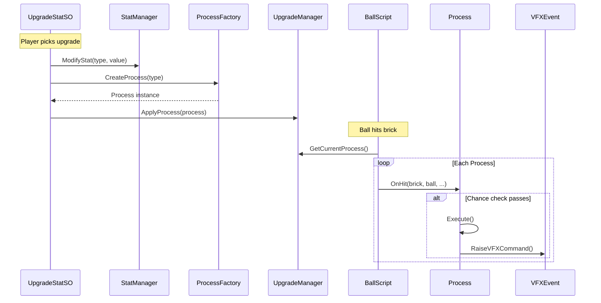

# SOScripts/PowerUp/ — Upgrade & Process System

## Module Summary

The core **data-driven upgrade system**. Contains the ScriptableObject definitions for upgrades (stats and behaviors) and the runtime `Process` classes that execute on-hit effects during gameplay.

## Sub-Folder Index

| Folder | Purpose |
|---|---|
| `Process/` | Concrete `Process` subclasses (explosions, lightning, freeze, etc.). |
| `Behavior/` | `IBehavior` implementations (e.g., magnet toggle). |

## Root Scripts

| Script | Type | Purpose |
|---|---|---|
| `UpgradeStatSO` | `ScriptableObject` | Stat-based upgrade: modifies `StatManager` values and optionally creates a `Process` via `ProcessFactory`. |
| `UpgradeBehaviorSO` | `ScriptableObject` | Behavior-based upgrade: applies `IBehavior` implementations (e.g., magnet). |
| `IBehavior` | Interface | Contract for behavior upgrades: `Apply(UpgradeManager)` and `Type`. |
| `Process` (base class) | Abstract class | Base for on-hit process strategies. Provides `GetChance()`, `CheckChance()`, `OnHit(BrickScript, ...)`. |
| `IProcess` | Interface | Minimal process contract marker. |

## Class Interactions

### Internal

1. `UpgradeStatSO.ApplyStat()` calls `StatManager.ModifyStat()` to bump a stat.
2. If the `UpgradeType` maps to a process, it creates one via `ProcessFactory.CreateProcess()` and registers it with `UpgradeManager.ApplyProcess()`.
3. `UpgradeBehaviorSO.ApplyBehavior()` iterates its `IBehavior[]` list and calls `Apply(upgradeManager)`.

### External

| Dependency | Relationship |
|---|---|
| `Manager/StatManager` | `UpgradeStatSO` modifies stats. |
| `Manager/UpgradeManager` | `UpgradeStatSO` registers processes. `UpgradeBehaviorSO` activates behaviors. |
| `Utils/ProcessFactory` | `UpgradeStatSO` creates process instances. |
| `VFX/VFXEvent` | `Process` subclasses raise VFX commands. |
| `BrickVariant/BrickEffect/*` | Some processes (Freeze, Poison) add effect components to bricks. |

## Design Patterns

- **Strategy** — Each `Process` subclass is an interchangeable on-hit strategy.
- **Template Method** — `Process.OnHit()` calls `CheckChance()` → subclass `Execute()`.
- **Composite** — `UpgradeBehaviorSO` holds an array of `IBehavior` implementations.

## Mermaid Diagram

