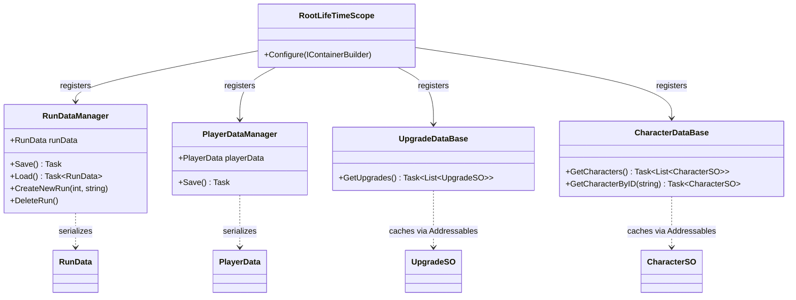

# Singleton/ — Root-Scoped Global Services

## Module Summary

Contains the **cross-scene persistent services** registered in `RootLifeTimeScope`.  
These survive scene transitions via VContainer's parent-child scope hierarchy and provide data persistence, asset caching, and audio playback to all downstream scenes.

## Scripts

| Script | Type | VContainer Registration | Purpose |
|---|---|---|---|
| `RootLifeTimeScope` | `LifetimeScope` | — (self) | Root DI container. Registers all services below. |
| `RunDataManager` | `MonoBehaviour` | `RegisterComponentInHierarchy` | Manages the current run's serialized save data (`RunData`). XOR-encrypted JSON persistence. |
| `PlayerDataManager` | `MonoBehaviour` | `RegisterComponentInHierarchy` | Manages long-lived player progress data (`PlayerData`). Also uses a legacy `static Instance`. |
| `UpgradeDataBase` | `MonoBehaviour` | `RegisterComponentInHierarchy` | Addressables-backed cache for all `UpgradeSO` assets. Lazy-loads on first access. |
| `CharacterDataBase` | `MonoBehaviour` | `RegisterComponentInHierarchy` | Addressables-backed cache for all `CharacterSO` assets. Provides ID-based lookup. |

## Class Interactions

### Internal

- `RootLifeTimeScope.Configure()` registers the four services; no direct coupling between them.
- Both `*DataManager` classes share the same XOR encryption utility from `PlayerData/XorUtility`.

### External

| Dependency | Consumer |
|---|---|
| `PlayerData/RunData` | `RunDataManager` serializes/deserializes it. |
| `PlayerData/PlayerData` | `PlayerDataManager` serializes/deserializes it. |
| `PlayerData/XorUtility` | Both data managers use XOR encryption. |
| `SOScripts/UpgradeSO` | `UpgradeDataBase` loads these via Addressables. |
| `SOScripts/CharacterSO` | `CharacterDataBase` loads these via Addressables. |
| `UnityEngine.AddressableAssets` | Both databases use `Addressables.LoadAssetsAsync`. |

## Dependency Injection (VContainer)

- **`RootLifeTimeScope`** is the **parent scope** for all scene-level scopes (`MainMenuLifeTimeScope`, `CharacterLifetimeScope`, `GameLifetimeScope`).
- All registrations are **`RegisterComponentInHierarchy`** (scene-bound MonoBehaviours on DontDestroyOnLoad GameObjects).
- No `IStartable` or `ITickable` registrations in this scope.

## Design Patterns

- **Repository Pattern** — `UpgradeDataBase` and `CharacterDataBase` act as in-memory caches with lazy-load semantics, abstracting Addressables from consumers.

## Decoupling Notes

- `RunDataManager` exposes `runData` as a public field — this is a **heavy coupling point**. Consumers directly mutate `RunData` properties (e.g., `OverwriteBricksData`). Consider introducing a façade API.
- `PlayerDataManager` retains a **legacy `static Instance`** alongside VContainer injection — a **refactoring candidate**.

## Mermaid Diagram

