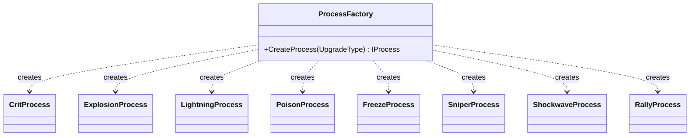

# Utils/ — Shared Utilities & Factories

## Module Summary

Cross-cutting utility scripts used by multiple modules. Includes the `ProcessFactory`, UI helpers, and extension methods.

## Scripts

| Script | Type | VContainer Registration | Purpose |
|---|---|---|---|
| `ProcessFactory` | POCO | `Singleton` in `GameLifetimeScope` | **Factory Pattern** — Maps `UpgradeType` to `Process` instances and injects dependencies via `IObjectResolver.Inject`. |
| `ListExtension` | Static class | — | Extension method `GetRandomElements<T>()` for random subset selection. |
| `GridAutoFit` | `MonoBehaviour` | — | Auto-resizes `GridLayoutGroup` cells based on container width. |
| `CloseScript` | `MonoBehaviour` | — | Generic close-panel button handler. |
| `OnClickOutSide` | `MonoBehaviour` | — | Detects clicks outside a panel to close it. |
| `OptionButton` | `MonoBehaviour` | — | Toggle option panel visibility. |
| `QuitScript` | `MonoBehaviour` | `RegisterComponentInHierarchy` | Handles quit/save flow on application pause and quit events. |
| `IVFXEvent` | Interface | — | Marker interface for VFX-capable processes (currently unused). |

## Class Interactions

### Internal
No inter-dependencies between scripts in this folder.

### External

| Dependency | Relationship |
|---|---|
| `SOScripts/Process/*` | `ProcessFactory` instantiates all `Process` subclasses. |
| `Enum/UpgradeType` | `ProcessFactory` switch key. |
| `GamePlayScripts/Shop/ShopManager` | Uses `ListExtension.GetRandomElements`. |

## Design Patterns

- **Factory** — `ProcessFactory.CreateProcess(UpgradeType)` is the central creation point for all on-hit process strategies.

## Decoupling Notes

> `ProcessFactory` is a plain C# class registered as `Singleton` and uses `IObjectResolver` to inject dependencies into dynamically created processes.

## Mermaid Diagram

