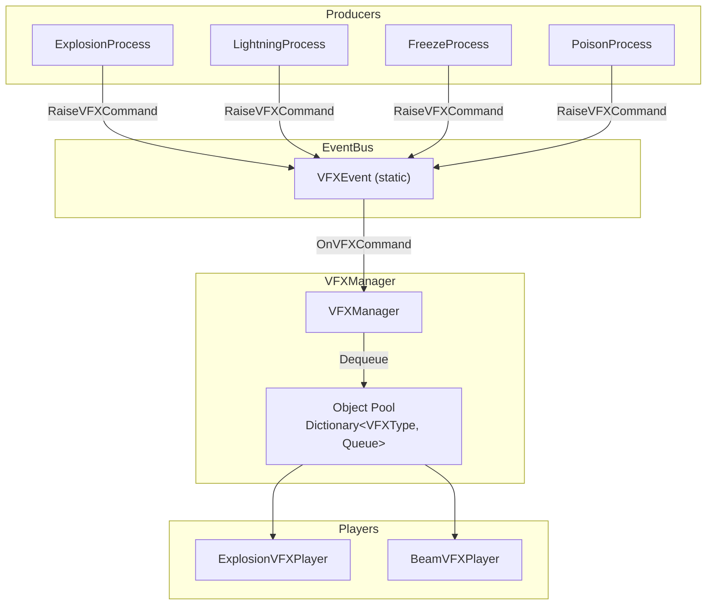

# VFX/ — Command-Pattern Visual Effects Pipeline

## Module Summary

A **Command-pattern VFX system** that decouples effect triggering (from `Process` classes) from effect execution (particle systems, line renderers). Uses a static event bus (`VFXEvent`) and pooled players managed by `VFXManager`.

## Scripts

| Script | Type | Purpose |
|---|---|---|
| `IVFXCommand` | Interface | Defines the command contract: `GetVFXType()` and `ExecuteOn(VFXPlayerBase, Action)`. |
| `IVFXPlayer` | Interface | Minimal player contract: `Execute(IVFXCommand, Action)`. |
| `VFXEvent` | Static class | Global event bus. `RaiseVFXCommand(IVFXCommand)` → `OnVFXCommand` event. |
| `VFXPlayerBase` | Abstract `MonoBehaviour` | Base class for VFX players. Provides template methods (`PlayExplosion`, `Play`, etc.). |
| `ExplosionVFXCommand` | Class | Command carrying position + radius for explosion VFX. |
| `ExplosionVFXPlayer` | `VFXPlayerBase` | Plays `ParticleSystem`-based explosion. |
| `HorizontalBeamVFXCommand` | Class | Command for horizontal beam VFX. |
| `VerticalBeamVFXCommand` | Class | Command for vertical beam VFX. |
| `LightningVFXCommand` | Class | Command carrying start/end positions for arc VFX. |
| `FreezeVFXCommand` | Class | Command for freeze effect at a position. |
| `PoisonVFXCommand` | Class | Command for poison cloud at a position. |
| `BeamVFXPlayer` | `VFXPlayerBase` | Line-renderer-based beam player. |

## Class Interactions

### Internal

1. A `Process` (e.g., `ExplosionProcess`) calls `VFXEvent.RaiseVFXCommand(new ExplosionVFXCommand(...))`.
2. `VFXEvent.OnVFXCommand` fires.
3. `VFXManager.HandleVFX(IVFXCommand)` dequeues a pooled `VFXPlayerBase` of the matching `VFXType`.
4. The command's `ExecuteOn(player, onComplete)` runs the visual effect.
5. `onComplete` callback returns the player to the pool.

### External

| Dependency | Relationship |
|---|---|
| `GamePlayScripts/Manager/VFXManager` | Subscribes to `VFXEvent.OnVFXCommand`, manages object pools. |
| `SOScripts/PowerUp/Process/*` | Producers that call `VFXEvent.RaiseVFXCommand`. |
| `Utils/IVFXEvent` | Optional VFX registration interface (not actively used). |

## Design Patterns

- **Command** — Each `IVFXCommand` encapsulates the data and execution method for a single VFX action. The command knows *how* to execute on a player, but not *which* player or *when*.
- **Object Pool** — `VFXManager` pre-warms and recycles `VFXPlayerBase` instances per `VFXType`.
- **Event Bus / Observer** — `VFXEvent` is a static decoupling layer. Producers (processes) never reference `VFXManager` directly.

## Decoupling Notes

- ✅ **Well-decoupled**: Process → VFXEvent → VFXManager. No direct references between upgrade logic and VFX rendering.
- ⚠️ `VFXEvent` is **static** — cannot be tested in isolation or replaced per-scope. Consider a VContainer-registered event bus for testability.

## Mermaid Diagram

